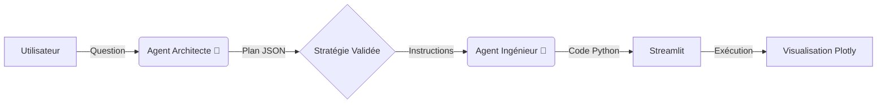

# 📊 AI DataViz Assistant (Architecture Multi-Agents)


## 📝 Description

**AI DataViz Assistant** est une application intelligente capable de transformer des questions en langage naturel en visualisations de données interactives et statistiquement pertinentes.

Ce projet se distingue par son **Architecture Multi-Agents (Scaffolding)** : au lieu d'utiliser un seul LLM qui risque d'halluciner, le travail est divisé entre un **Architecte** (qui conçoit la stratégie) et un **Ingénieur** (qui génère le code Python).

---

## 🚀 Fonctionnalités Clés

* **🧠 Architecture Scaffolding :** Séparation des responsabilités (Planification vs Exécution) pour une fiabilité accrue.
* **📊 Intelligence Statistique :**
    * Détection automatique des besoins d'agrégation (ex: Moyennes, Taux).
    * Gestion des distributions (Box Plots sans agrégation abusive).
    * Analyses de corrélation (Scatter Plots avec lignes de tendance).
* **🛡️ Génération de Code Robuste :** Mécanismes "Anti-Crash" pour gérer les erreurs de librairies (`statsmodels`) et les incompatibilités d'arguments Plotly.
* **🎨 Design Automatisé :** Graphiques esthétiques (`plotly_white`), titres centrés et palettes de couleurs adaptées.
* **📂 Support Universel :** Compatible avec l'upload de fichiers CSV et des datasets de démonstration (Titanic, Tips, Iris...).

---

## 🏗️ Architecture Technique

Le projet repose sur un pipeline en deux étapes strictes :

---

## 📂 Structure du Projet

```
projet_data_visualisation/
├── .env                     # Clé API Google (GEMINI_API_KEY)
├── pyproject.toml           # Gestion des dépendances (uv)
├── src/
│   ├── main.py              # Point d'entrée Streamlit (Interface)
│   ├── modules/
│   │   ├── architect.py     # Cerveau : Décide du type de viz
│   │   ├── engineer.py      # Mains : Génère le code Plotly
│   │   └── llm_factory.py   # Configuration du modèle Gemini
│   └── utils/
│       └── data_loader.py   # Chargement CSV & Datasets
└── README.md
```
---
## 💻 Instructions d'Installation
Ce projet a été développé avec Python 3.10+.

**1. Cloner le dépôt**

git clone [https://github.com/votre-username/ai-dataviz.git](https://github.com/votre-username/ai-dataviz.git)

cd ai-dataviz

**2. Configurer la clé API**

GOOGLE_API_KEY="votre_clé_api_ici"

**3. Installer les dépendances**

pip install uv

uv sync
---
## 🚀 Instructions de Lancement

Une fois l'installation terminée, lancez l'application avec la commande suivante :
uv run streamlit run src/app.py